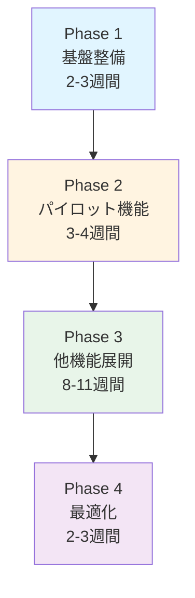

# マイ家計簿アプリケーション リファクタリング計画書

**作成日**: 2025年11月15日  
**更新日**: 2025年11月27日（固定費管理の優先度をBに引き上げ）  
**対象システム**: MyHouseholdAccountBook  
**リファクタリング方式**: 段階的DDD適用

---

## 目次

1. [リファクタリングの目標](#1-リファクタリングの目標)
2. [基本方針](#2-基本方針)
3. [段階的アプローチ](#3-段階的アプローチ)
4. [Phase 1: 基盤整備](#4-phase-1-基盤整備)
5. [Phase 2: パイロット機能のリファクタリング](#5-phase-2-パイロット機能のリファクタリング)
6. [Phase 3: 他機能への展開](#6-phase-3-他機能への展開)
7. [Phase 4: 最適化と改善](#7-phase-4-最適化と改善)
8. [テスト戦略](#8-テスト戦略)
9. [リスク管理](#9-リスク管理)
10. [成功基準](#10-成功基準)

---

## 1. リファクタリングの目標

### 1.1 主目標

**「ユースケース層からドメイン層への業務ロジックの移動により、保守性・テスト容易性・拡張性を向上させる」**

### 1.2 具体的な目標値

| 指標 | 現状 | 目標 |
|------|------|------|
| ユースケースクラスの平均行数 | 200行超 | 100行以下 |
| ドメインモデルのメソッド数 | 平均2個 | 平均5個以上 |
| テストカバレッジ（ドメイン層） | 未測定 | 80%以上 |
| 業務ロジックのドメイン層集中度 | 推定30% | 80%以上 |

### 1.3 定性的な目標

- ✅ ビジネスルールがコードで明確に表現される
- ✅ 新機能追加時の影響範囲が限定される
- ✅ テストが書きやすく、保守しやすい
- ✅ ドメイン知識がコードに蓄積される

---

## 2. 基本方針

### 2.1 段階的リファクタリング

**一度にすべてを書き換えない**

- 機能ごとに完全にリファクタリング
- 動作確認とテスト実施
- 次の機能へ

### 2.2 既存機能の維持

**すべてのリファクタリングにおいて、既存機能は維持する**

- 機能追加なし（リファクタリングに専念）
- UI変更なし
- データ構造変更なし（可能な限り）

### 2.3 テストファースト

**リファクタリング前にテストを書く**

1. 既存機能のテストを書く
2. グリーンを確認
3. リファクタリング実施
4. テストがグリーンのまま

### 2.4 小さなステップ

**1コミット = 1つの明確な変更**

- コミットメッセージで意図を明確に
- レビュー可能な単位で分割
- いつでもロールバック可能

---

## 3. 段階的アプローチ

### 3.1 全体の流れ



### 3.2 各Phaseの概要

| Phase | 期間 | 主な作業 | 成果物 |
|-------|------|---------|--------|
| Phase 1 | 2-3週間 | 基盤クラス作成、テスト環境整備 | 基底クラス、ユーティリティ |
| Phase 2 | 3-4週間 | 月次収支照会機能の完全DDD化 | リファクタリング完了機能 |
| Phase 3 | 8-11週間 | 他機能への展開（固定費管理を含む） | 全機能のDDD化 |
| Phase 4 | 2-3週間 | パフォーマンス改善、ドキュメント整備 | 最終成果物 |

**合計見積もり**: 15-21週間（3.75-5.25ヶ月）

**注**: Phase 3が延長された理由は、固定費管理の優先度をBに引き上げたため。固定費管理は収支管理の中核機能であり、複雑なビジネスロジック（スケジュール判定、支出自動生成、有効期間管理）を持つため、2-3週間の工数が必要。

---

## 4. Phase 1: 基盤整備

**期間**: 2-3週間  
**目的**: リファクタリングに必要な基盤を整備

### 4.1 作業項目

#### 4.1.1 値オブジェクト基底クラスの作成

**優先度**: 高

```java
// 作成するクラス
- Money (抽象クラス)
  - IncomeAmount
  - ExpenditureAmount
  - BalanceAmount
- Identifier (抽象クラス)
  - UserId
  - IncomeId
  - ExpenditureId
  - ExpenditureCategoryId
- DateValue (抽象クラス)
  - TargetYearMonth
  - PaymentDate
  - IncomeDate
```

**作業ステップ**:
1. Money抽象クラスの作成
2. IncomeAmountの作成とテスト
3. ExpenditureAmountの作成とテスト
4. 他の金額系値オブジェクトの作成

**所要時間**: 3-4日

#### 4.1.2 ドメイン例外クラスの作成

```java
- DomainException (基底)
- IncomeAndExpenditureInconsistencyException
- InvalidValueException
- AggregateNotFoundException
```

**所要時間**: 1日

#### 4.1.3 テスト環境の整備

**設定項目**:
- JUnit 5の設定確認
- Mockitoの設定
- テストデータビルダーの作成
- テスト用ヘルパークラスの作成

**所要時間**: 2-3日

#### 4.1.4 共通ユーティリティの作成

```java
- CollectionUtils
- StringUtils (ドメイン用)
- ValidationUtils
```

**所要時間**: 1-2日

### 4.2 Phase 1 成果物

- ✅ 値オブジェクト基底クラス群
- ✅ ドメイン例外クラス群
- ✅ テスト環境
- ✅ 共通ユーティリティ

### 4.3 Phase 1 完了基準

- [ ] すべての基底クラスにテストが存在
- [ ] テストカバレッジ90%以上
- [ ] コードレビュー完了
- [ ] ドキュメント更新

---

## 5. Phase 2: パイロット機能のリファクタリング

**期間**: 3-4週間  
**目的**: 1機能を完全にDDD化し、パターンを確立

### 5.1 パイロット機能の選定

**選定機能**: 月次収支照会（AccountMonthInquiry）

**選定理由**:
1. 中程度の複雑さ（複雑すぎず、簡単すぎず）
2. 照会系なので影響範囲が限定的
3. 既存のドメインモデルが存在
4. 業務ルールが明確（収支の整合性）

### 5.2 リファクタリング手順

#### Step 1: 既存機能のテスト作成（1週間）

**作業内容**:

1. **統合テストの作成**
```java
@SpringBootTest
class AccountMonthInquiryIntegrationTest {
    
    @Test
    void 月次収支照会_正常系() {
        // Given: テストデータ準備
        // When: 照会実行
        // Then: 期待する結果が返る
    }
    
    @Test
    void 月次収支照会_データなし() {
        // データがない場合のテスト
    }
}
```

2. **ユースケーステストの作成**
```java
class AccountMonthInquiryUseCaseTest {
    // 現在のロジックをテスト
}
```

**完了基準**:
- [ ] 主要シナリオのテストが通る
- [ ] エッジケースのテストが通る

#### Step 2: ドメインモデルの作成（1週間）

**作業内容**:

1. **集約の作成**
```java
public class IncomeAndExpenditure {
    // 集約ルート
    // 不変条件を保護
}
```

2. **エンティティの作成**
```java
public class Income { ... }
public class Expenditure { ... }
```

3. **値オブジェクトの作成**
```java
public class ExpenditureSummary { ... }
```

4. **ドメインサービスの作成**
```java
public class IncomeAndExpenditureService {
    public void validateConsistency(...) { ... }
}
```

**完了基準**:
- [ ] すべてのドメインモデルにテストが存在
- [ ] 業務ロジックがドメインモデルに存在
- [ ] テストカバレッジ80%以上

#### Step 3: ユースケースのリファクタリング（1週間）

**リファクタリング前**:
```java
public class AccountMonthInquiryUseCase {
    public AccountMonthInquiryResponse execRead(...) {
        // 200行以上のロジック
        // データ取得
        // 整合性チェック
        // 計算
        // 変換
    }
}
```

**リファクタリング後**:
```java
public class AccountMonthInquiryUseCase {
    
    private final IncomeAndExpenditureRepository repository;
    private final IncomeAndExpenditureService domainService;
    
    public AccountMonthInquiryResponse read(UserId userId, TargetYearMonth yearMonth) {
        // 1. ドメインオブジェクトを取得
        IncomeAndExpenditure incomeAndExpenditure = 
            repository.findByUserIdAndYearMonth(userId, yearMonth)
                .orElseThrow(() -> new IncomeAndExpenditureNotFoundException());
        
        // 2. ドメインサービスで整合性検証
        domainService.validateConsistency(incomeAndExpenditure);
        
        // 3. レスポンスに変換
        return toResponse(incomeAndExpenditure);
    }
    
    private AccountMonthInquiryResponse toResponse(IncomeAndExpenditure domain) {
        // 変換処理のみ
    }
}
```

**削減される行数**: 約200行 → 約50行

**完了基準**:
- [ ] ユースケースが100行以下
- [ ] 業務ロジックがドメイン層に存在
- [ ] すべてのテストが通る

#### Step 4: リポジトリの整理（2-3日）

**作業内容**:

```java
// リポジトリインターフェース（ドメイン層）
public interface IncomeAndExpenditureRepository {
    Optional<IncomeAndExpenditure> findByUserIdAndYearMonth(
        UserId userId, 
        TargetYearMonth yearMonth
    );
}

// リポジトリ実装（インフラ層）
@Repository
public class IncomeAndExpenditureDataSource 
        implements IncomeAndExpenditureRepository {
    
    @Override
    public Optional<IncomeAndExpenditure> findByUserIdAndYearMonth(...) {
        // DTO取得
        // DTO → ドメインモデル変換
        // 関連エンティティの取得と設定
    }
}
```

**完了基準**:
- [ ] リポジトリが正しく動作
- [ ] 統合テストが通る

#### Step 5: 統合テストの実行（2-3日）

**確認項目**:
- [ ] すべての統合テストが通る
- [ ] 既存機能が正常に動作
- [ ] パフォーマンスが劣化していない

### 5.3 Phase 2 成果物

- ✅ 完全にDDD化された月次収支照会機能
- ✅ リファクタリングパターンの確立
- ✅ テストが充実したドメインモデル

### 5.4 Phase 2 完了基準

- [ ] すべてのテストが通る（統合テスト含む）
- [ ] ユースケースが100行以下
- [ ] ドメインモデルのテストカバレッジ80%以上
- [ ] コードレビュー完了
- [ ] リファクタリングパターンのドキュメント化

---

## 6. Phase 3: 他機能への展開

**期間**: 8-11週間（固定費管理の優先度引き上げにより延長）  
**目的**: Phase 2で確立したパターンを他機能に適用

### 6.1 機能の優先順位

Phase 2で確立したパターンを以下の順序で適用：

#### 優先度A（高）: 4-5週間

1. **年次収支照会** (AccountYearInquiry) - 2週間
   - 月次収支照会と類似
   - 集約はほぼ同じ

2. **収支登録** (IncomeAndExpenditureRegist) - 2-3週間
   - 書き込み処理
   - トランザクション管理が重要

#### 優先度B（中）: 4-6週間

3. **買い物登録** (ShoppingRegist) - 1-2週間
   - 新しい集約（Shopping）
   - 支出への変換ロジック

4. **支出項目管理** (ExpenditureItemManage) - 1週間
   - マスタ管理
   - 階層構造の扱い

5. **固定費管理** (FixedCostManage) - 2-3週間
   - 新しい集約（FixedCost）
   - 複雑なスケジュール判定ロジック
   - 収支生成サービスとの連携
   - 値オブジェクト（PaymentSchedule、ValidPeriod）の実装
   - **重要**: 収支管理の中核機能のため優先度を引き上げ

#### 優先度C（低）: 適宜実施

6. **店舗管理** (ShopManage)
7. **イベント管理** (EventManage)
8. **商品管理** (ShoppingItemManage)

### 6.2 各機能のリファクタリング手順

Phase 2で確立したパターンを踏襲：

```
1. 既存機能のテスト作成 → 2-3日
2. ドメインモデルの作成 → 3-5日
3. ユースケースのリファクタリング → 2-3日
4. リポジトリの整理 → 1-2日
5. 統合テストの実行 → 1-2日
```

**1機能あたりの所要時間**: 1.5-2週間

#### 6.2.1 固定費管理の詳細手順

固定費管理は複雑なビジネスロジックを持つため、特別な注意が必要：

**Week 1: ドメインモデル作成**
- [ ] FixedCost集約の設計と実装
- [ ] PaymentSchedule値オブジェクトの実装
- [ ] ValidPeriod値オブジェクトの実装
- [ ] ScheduleType列挙型の実装
- [ ] FixedCostRepository IFの定義

**Week 2: ドメインサービスとリポジトリ**
- [ ] IncomeAndExpenditureGenerationServiceの実装
- [ ] FixedCostRepositoryの実装（DataSource）
- [ ] スケジュール判定ロジックの単体テスト
- [ ] 支出生成ロジックの単体テスト

**Week 3: 統合とテスト**
- [ ] ユースケース層の実装
- [ ] 固定費CRUD機能の実装
- [ ] 収支自動生成機能との統合テスト
- [ ] エンドツーエンドテスト

**重要な検証ポイント**:
1. スケジュールパターン（毎月、年次、隔月）の正確性
2. 有効期間の境界値テスト（開始月、終了月）
3. 収支生成サービスとの連携
4. トランザクション境界の適切性

**所要時間**: 2-3週間

### 6.3 Phase 3 完了基準

- [ ] すべての主要機能がDDD化完了（収支、買い物、支出項目、固定費）
- [ ] 固定費からの支出自動生成が正常に動作
- [ ] すべての統合テストが通る
- [ ] 全体のテストカバレッジ80%以上
- [ ] コードレビュー完了

---

## 7. Phase 4: 最適化と改善

**期間**: 2-3週間  
**目的**: パフォーマンス改善とドキュメント整備

### 7.1 パフォーマンス改善

#### 7.1.1 N+1問題の解消

**調査対象**:
- 収支照会時の支出明細取得
- 支出項目階層の取得

**改善方法**:
- 一括取得クエリの実装
- キャッシュの活用

#### 7.1.2 不要なクエリの削除

**調査**:
- スロークエリログの分析
- 使用されていないクエリの削除

### 7.2 ドキュメント整備

#### 7.2.1 コードドキュメント

- [ ] JavaDocの整備
- [ ] READMEの更新
- [ ] アーキテクチャドキュメントの更新

#### 7.2.2 運用ドキュメント

- [ ] デプロイ手順の確認
- [ ] ロールバック手順の確認

### 7.3 Phase 4 完了基準

- [ ] パフォーマンスが改善（または維持）
- [ ] ドキュメントが最新
- [ ] 本番環境へのデプロイ準備完了

---

## 8. テスト戦略

### 8.1 テストレベル

#### レベル1: 単体テスト（ドメイン層）

**対象**:
- 値オブジェクト
- エンティティ
- 集約
- ドメインサービス

**カバレッジ目標**: 90%以上

**テスト例**:
```java
class IncomeAmountTest {
    
    @Test
    void 正の金額で生成できる() {
        IncomeAmount amount = IncomeAmount.of(new BigDecimal("10000"));
        assertThat(amount.getValue()).isEqualTo(new BigDecimal("10000"));
    }
    
    @Test
    void 負の金額で例外が発生する() {
        assertThatThrownBy(() -> 
            IncomeAmount.of(new BigDecimal("-1000"))
        ).isInstanceOf(IllegalArgumentException.class);
    }
}
```

#### レベル2: 統合テスト（ユースケース層）

**対象**:
- ユースケース
- リポジトリ実装

**カバレッジ目標**: 80%以上

**テスト例**:
```java
@SpringBootTest
class AccountMonthInquiryUseCaseIntegrationTest {
    
    @Autowired
    private AccountMonthInquiryUseCase useCase;
    
    @Test
    void 月次収支照会が正しく動作する() {
        // Given
        UserId userId = UserId.of("user001");
        TargetYearMonth yearMonth = TargetYearMonth.of(2023, 11);
        
        // When
        AccountMonthInquiryResponse response = useCase.read(userId, yearMonth);
        
        // Then
        assertThat(response.getTotalIncome()).isEqualTo("300000");
        assertThat(response.getTotalExpenditure()).isEqualTo("250000");
        assertThat(response.getBalance()).isEqualTo("50000");
    }
}
```

#### レベル3: E2Eテスト

**対象**:
- 主要なユーザーシナリオ

**実施タイミング**:
- 各Phase完了時
- リリース前

### 8.2 テストデータ戦略

#### テストデータビルダーの活用

```java
public class IncomeAndExpenditureTestDataBuilder {
    
    private UserId userId = UserId.of("test_user");
    private TargetYearMonth yearMonth = TargetYearMonth.of(2023, 11);
    private List<Income> incomes = new ArrayList<>();
    private List<Expenditure> expenditures = new ArrayList<>();
    
    public IncomeAndExpenditureTestDataBuilder withUserId(String userId) {
        this.userId = UserId.of(userId);
        return this;
    }
    
    public IncomeAndExpenditureTestDataBuilder withIncome(
            String name, 
            BigDecimal amount) {
        this.incomes.add(Income.create(
            IncomeName.of(name),
            IncomeAmount.of(amount),
            // ...
        ));
        return this;
    }
    
    public IncomeAndExpenditure build() {
        return IncomeAndExpenditure.create(
            userId,
            yearMonth,
            incomes,
            expenditures
        );
    }
}

// 使用例
IncomeAndExpenditure testData = new IncomeAndExpenditureTestDataBuilder()
    .withUserId("user001")
    .withIncome("給料", new BigDecimal("300000"))
    .withExpenditure("食費", new BigDecimal("50000"))
    .build();
```

### 8.3 テスト実施タイミング

| タイミング | テストレベル | 実施内容 |
|-----------|------------|---------|
| コード変更時 | 単体テスト | 関連する単体テストを実行 |
| コミット前 | 単体+統合 | 全単体テスト + 関連統合テスト |
| Phase完了時 | すべて | 全テスト実行 |
| リリース前 | すべて | 全テスト + 手動テスト |

---

## 9. リスク管理

### 9.1 想定リスクと対策

| リスク | 影響度 | 発生確率 | 対策 |
|--------|--------|---------|------|
| リファクタリングでバグ混入 | 高 | 中 | テストファーストの徹底 |
| 想定以上の工数 | 中 | 高 | 小さなステップで進める |
| パフォーマンス劣化 | 中 | 低 | Phase 4で改善、事前計測 |
| ドメイン知識の誤理解 | 高 | 低 | ドメインエキスパートとの確認 |
| 既存データとの不整合 | 高 | 低 | データ移行テスト |

### 9.2 リスク対応計画

#### リスク1: リファクタリングでバグ混入

**対策**:
1. リファクタリング前に必ずテストを書く
2. 小さなステップで進める
3. コードレビューの徹底
4. 統合テストの実施

**緊急時対応**:
- Git でロールバック
- 問題箇所の特定と修正

#### リスク2: 想定以上の工数

**対策**:
1. バッファを持った計画（+20%）
2. 週次で進捗確認
3. 優先度の見直し

**緊急時対応**:
- Phase 3の優先度C機能を後回し
- 機能ごとにリリース判断

---

## 10. 成功基準

### 10.1 定量的基準

| 項目 | 現状 | 目標 | 測定方法 |
|------|------|------|---------|
| ユースケースクラス平均行数 | 200行 | 100行以下 | コード解析ツール |
| ドメイン層テストカバレッジ | 未測定 | 80%以上 | JaCoCo |
| ドメインモデルのメソッド数 | 平均2個 | 平均5個以上 | 手動カウント |
| 統合テストの成功率 | - | 100% | CI/CD |

### 10.2 定性的基準

- ✅ コードがビジネスルールを表現している
- ✅ 新機能追加が容易になった
- ✅ テストが書きやすくなった
- ✅ チームメンバーがDDDを理解した

### 10.3 検収基準

#### Phase 2完了時

- [ ] 月次収支照会機能が完全にDDD化
- [ ] すべてのテストが通る
- [ ] パフォーマンスが維持されている
- [ ] リファクタリングパターンが確立

#### Phase 3完了時

- [ ] 主要機能がすべてDDD化
- [ ] 全体のテストカバレッジ80%以上
- [ ] すべての統合テストが通る

#### Phase 4完了時

- [ ] パフォーマンスが改善（または維持）
- [ ] ドキュメントが整備されている
- [ ] 本番環境デプロイ準備完了

---

## 11. スケジュール

### 11.1 ガントチャート（概要）

```
Week  1  2  3  4  5  6  7  8  9 10 11 12 13 14 15 16 17 18
─────────────────────────────────────────────────────────
Phase 1: 基盤整備
■■■■■■■■■■
         Phase 2: パイロット
         ■■■■■■■■■■■■■■■■■■■■
                              Phase 3: 展開
                              ■■■■■■■■■■■■■■■■■■■■■■■■■■■■■■
                                                                Phase 4
                                                                ■■■■■■■■
```

### 11.2 マイルストーン

| マイルストーン | 予定週 | 成果物 |
|--------------|--------|--------|
| M1: 基盤整備完了 | Week 3 | 基底クラス群 |
| M2: パイロット完了 | Week 7 | 月次収支照会DDD化 |
| M3: 優先度A完了 | Week 12 | 主要機能DDD化 |
| M4: 優先度B完了 | Week 15 | ほぼ全機能DDD化 |
| M5: 最終完了 | Week 18 | 全機能DDD化+最適化 |

---

## 12. 次のアクション

### 12.1 即座に着手すべきこと

1. **Phase 1の開始**
   - Money抽象クラスの作成
   - テスト環境の整備

2. **開発環境の準備**
   - VS Codeの設定
   - Claude Codeの活用準備

3. **チーム共有**
   - このドキュメントのレビュー
   - リファクタリング方針の合意

### 12.2 週次で実施すること

- 進捗確認ミーティング
- リスクの洗い出し
- 次週の作業計画

---

## 付録A: チェックリスト

### リファクタリング前チェックリスト

- [ ] 既存機能のテストが存在する
- [ ] テストがすべて通る
- [ ] リファクタリング対象が明確
- [ ] 影響範囲を把握している

### リファクタリング中チェックリスト

- [ ] 小さなステップで進めている
- [ ] こまめにコミットしている
- [ ] テストが常にグリーン
- [ ] コードレビューを受けている

### リファクタリング後チェックリスト

- [ ] すべてのテストが通る
- [ ] 新しいテストを追加した
- [ ] ドキュメントを更新した
- [ ] パフォーマンスを確認した

---

## 付録B: 参考資料

### 推奨書籍

1. **ドメイン駆動設計** - Eric Evans
2. **実践ドメイン駆動設計** - Vaughn Vernon
3. **レガシーコードからの脱却** - Michael Feathers

### 参考リンク

- Spring Boot公式ドキュメント
- MyBatis公式ドキュメント
- JUnit 5公式ドキュメント

---

---

## 付録C: UI変更が必要な項目

### C.1 クーポン金額の入力方法変更

**実装フェーズ**: Phase 3（買い物登録機能のリファクタリング時）

#### 現状
- 画面でマイナス値を入力する仕様
  - 例: クーポン500円 → 入力値「-500」
- データベースにもマイナス値として保存
- 支出金額から減算する計算ロジック

#### 変更後
- 画面で正の値を入力する仕様に変更
  - 例: クーポン500円 → 入力値「500」
- CouponAmount値オブジェクトが内部的にマイナス化
- ユーザーは割引額として直感的に入力可能

#### 変更理由
- CouponAmount値オブジェクトの設計方針
  - 正の値を受け付け、内部でマイナス値に変換
  - ビジネスルールの明確化（割引額は0以上）
  - 型安全性の向上

#### 影響範囲

| 影響箇所 | 変更内容 | 優先度 |
|---------|---------|--------|
| 買い物登録画面 | 入力フィールドのバリデーション変更 | 高 |
| JavaScript | 入力チェックロジックの修正 | 高 |
| 画面表示 | クーポン金額の表示方法見直し | 中 |
| ヘルプ・説明文 | 入力方法の説明文更新 | 中 |

#### 実装手順

1. **バックエンド**: CouponAmount値オブジェクトの作成（Phase 1で完了）
2. **画面入力バリデーション**: 正の値を受け付けるように変更
   ```javascript
   // 変更前
   if (couponAmount >= 0) {
       showError("クーポン金額はマイナス値で入力してください");
   }

   // 変更後
   if (couponAmount < 0) {
       showError("クーポン金額は正の値で入力してください");
   }
   ```

3. **コントローラー**: 入力値の処理を変更
   ```java
   // 変更前
   CouponAmount coupon = CouponAmount.from(request.getCouponAmount()); // マイナス値で受け取る

   // 変更後
   CouponAmount coupon = CouponAmount.from(request.getCouponAmount()); // 正の値で受け取る
   ```

4. **画面表示**: クーポン金額を表示する際は`getDiscountAmount()`を使用
   ```java
   // 表示用
   model.addAttribute("couponAmount", coupon.getDiscountAmount()); // 正の値で表示
   ```

#### テスト観点

- [ ] 正の値で正常に登録できる
- [ ] マイナス値で入力時にエラーが表示される
- [ ] 0円で登録できる
- [ ] 登録後の支出合計が正しく計算される
- [ ] 既存データ（マイナス値で保存されているデータ）の表示が正常

#### 注意事項

**既存データの扱い**:
- データベースには既にマイナス値で保存されているデータが存在
- 表示時は`CouponAmount.getDiscountAmount()`を使用して正の値に変換
- データ移行は不要（値オブジェクトが吸収）

**段階的移行**:
1. Phase 1: CouponAmount値オブジェクト作成（完了）
2. Phase 3: 買い物登録機能リファクタリング時にUI変更を実施
3. リリース前: 入力方法変更の告知をユーザーに通知

---

**作成者**: Claude (Anthropic)
**最終更新**: 2025年11月23日

---

**すべてのドキュメントが完成しました！**

次は、VS CodeのClaude Codeを使用して実際のリファクタリング作業を開始できます。
Phase 1の基盤整備から始めることをお勧めします。
