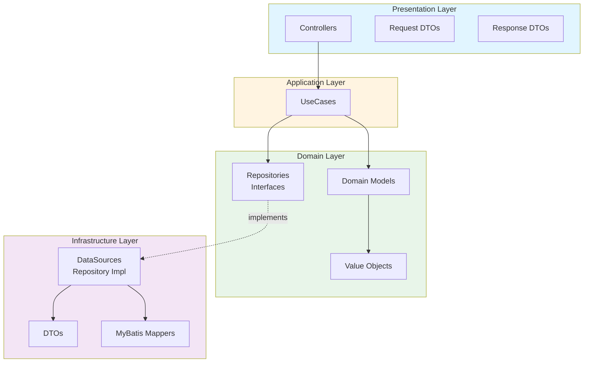
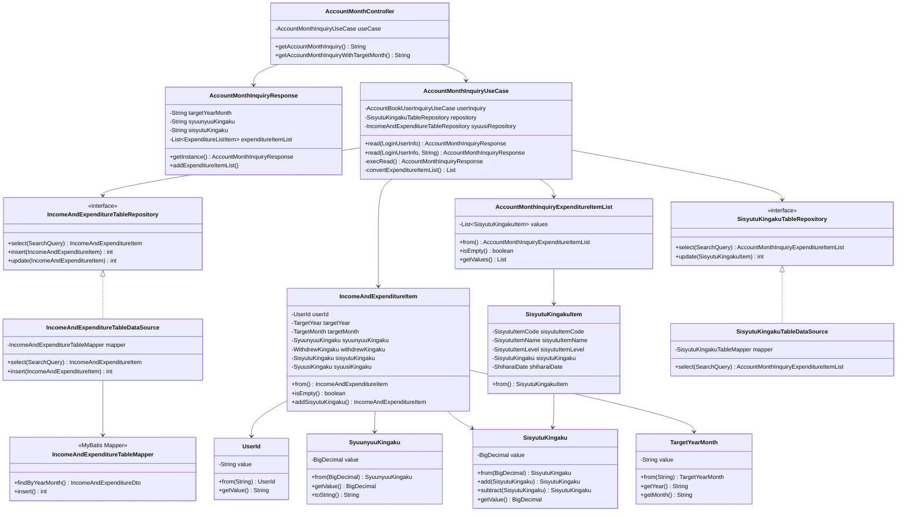
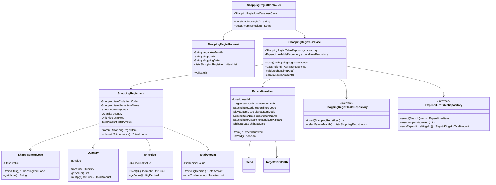
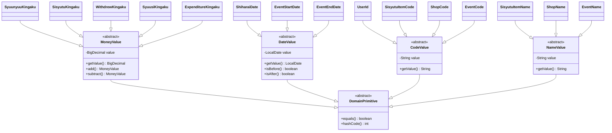
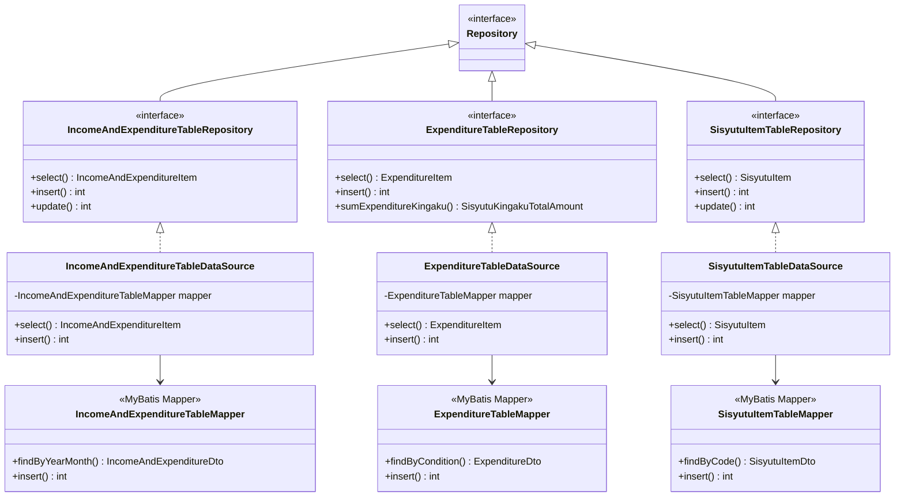
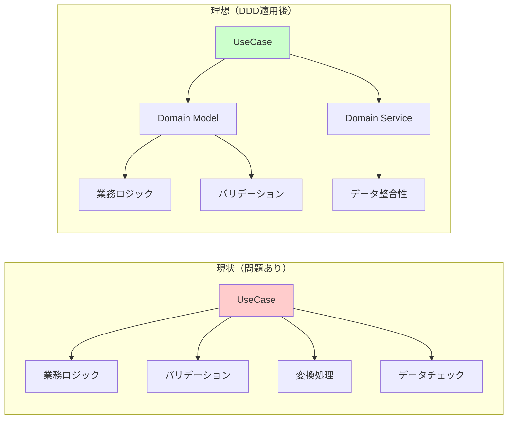

# マイ家計簿アプリケーション 現状クラス図

**作成日**: 2025年11月15日

---

## 1. 全体アーキテクチャ図

---

## 2. 主要クラス図：月次収支照会機能

### 2.1 クラス関係図

---

## 3. 主要クラス図：買い物登録機能

### 3.1 クラス関係図

---

## 4. ドメインモデル継承階層

### 4.1 値オブジェクト階層

---

## 5. リポジトリパターン構造

---

## 6. 現状の問題点（クラス図からの考察）

### 6.1 ユースケース層の肥大化

### 6.2 ドメインモデルの貧弱性

**現状の問題**:
- ドメインモデルはデータ保持が主
- 業務ロジックがユースケース層に散在
- ドメインサービスが不足

**改善後の姿**:
- ドメインモデルに業務ロジックを集約
- ドメインサービスで複数エンティティにまたがるロジックを管理
- 集約による整合性保証

---

## 7. まとめ

### 現状の特徴

✅ **良い点**:
- レイヤー分離が明確
- 値オブジェクトを活用
- リポジトリパターンの採用
- 不変オブジェクト設計

⚠️ **改善点**:
- ユースケース層への業務ロジック集中
- ドメインモデルの貧弱性（貧血ドメインモデル）
- 集約の境界が不明確
- ドメインサービスの不足

### リファクタリングの方向性

1. **ドメインモデルの強化**
   - エンティティに業務ロジックを移動
   - 集約の明確化
   - ドメインサービスの抽出

2. **ユースケースの責任縮小**
   - オーケストレーション role に専念
   - ドメインモデルへの委譲

3. **値オブジェクトの充実**
   - バリデーションロジックの内包
   - ドメイン計算の実装

---

**次のドキュメント**: 
- [ER図](./03_ER図.md)
- [要件定義書](./04_要件定義書.md)

---

**作成者**: Claude (Anthropic)  
**最終更新**: 2025年11月15日
