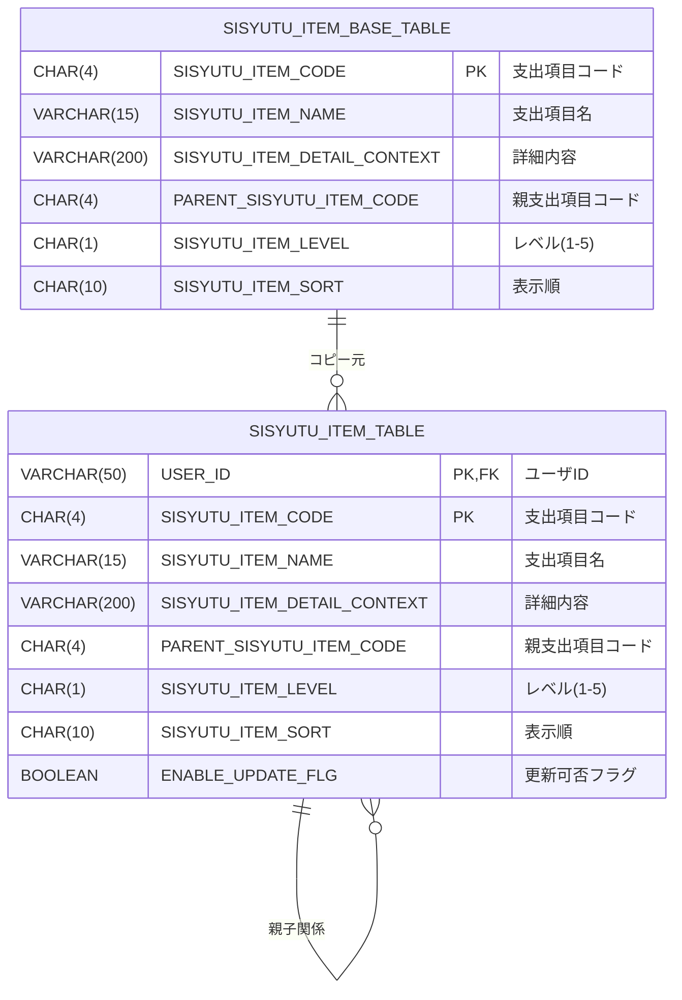
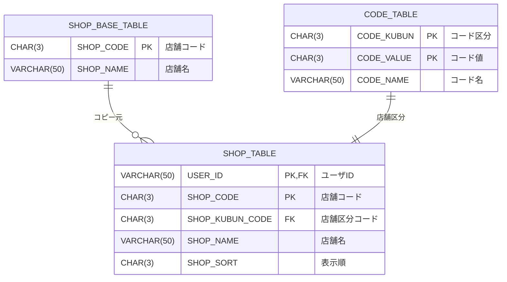

# マイ家計簿アプリケーション ER図

**作成日**: 2025年11月15日

---

## 1. 全体ER図

```mermaid
erDiagram
    ACCOUNT_BOOK_USER ||--o{ SISYUTU_ITEM_TABLE : "所有"
    ACCOUNT_BOOK_USER ||--o{ SHOP_TABLE : "所有"
    ACCOUNT_BOOK_USER ||--o{ SHOPPING_ITEM_TABLE : "所有"
    ACCOUNT_BOOK_USER ||--o{ FIXED_COST_TABLE : "所有"
    ACCOUNT_BOOK_USER ||--o{ EVENT_ITEM_TABLE : "所有"
    ACCOUNT_BOOK_USER ||--o{ INCOME_AND_EXPENDITURE_TABLE : "所有"
    ACCOUNT_BOOK_USER ||--o{ SISYUTU_KINGAKU_TABLE : "所有"
    ACCOUNT_BOOK_USER ||--o{ EXPENDITURE_TABLE : "所有"
    ACCOUNT_BOOK_USER ||--o{ INCOME_TABLE : "所有"
    
    SISYUTU_ITEM_TABLE ||--o{ SHOPPING_ITEM_TABLE : "分類"
    SISYUTU_ITEM_TABLE ||--o{ FIXED_COST_TABLE : "分類"
    SISYUTU_ITEM_TABLE ||--o{ EVENT_ITEM_TABLE : "分類"
    SISYUTU_ITEM_TABLE ||--o{ SISYUTU_KINGAKU_TABLE : "集計"
    SISYUTU_ITEM_TABLE ||--o{ EXPENDITURE_TABLE : "分類"
    
    SISYUTU_ITEM_BASE_TABLE ||--o{ SISYUTU_ITEM_TABLE : "マスタ"
    SHOP_BASE_TABLE ||--o{ SHOP_TABLE : "マスタ"
    
    SHOP_TABLE ||--o{ SHOPPING_ITEM_TABLE : "基準店舗"
    
    EVENT_ITEM_TABLE ||--o{ EXPENDITURE_TABLE : "イベント"
    
    INCOME_AND_EXPENDITURE_TABLE ||--|| SISYUTU_KINGAKU_TABLE : "年月"
    INCOME_AND_EXPENDITURE_TABLE ||--|| EXPENDITURE_TABLE : "年月"
    INCOME_AND_EXPENDITURE_TABLE ||--|| INCOME_TABLE : "年月"
    
    ACCOUNT_BOOK_USER {
        VARCHAR(50) USER_ID PK
        CHAR(4) NOW_TARGET_YEAR PK
        CHAR(2) NOW_TARGET_MONTH PK
        VARCHAR(100) USER_NAME
    }
    
    SISYUTU_ITEM_TABLE {
        VARCHAR(50) USER_ID PK,FK
        CHAR(4) SISYUTU_ITEM_CODE PK
        VARCHAR(15) SISYUTU_ITEM_NAME
        VARCHAR(200) SISYUTU_ITEM_DETAIL_CONTEXT
        CHAR(4) PARENT_SISYUTU_ITEM_CODE
        CHAR(1) SISYUTU_ITEM_LEVEL
        CHAR(10) SISYUTU_ITEM_SORT
        BOOLEAN ENABLE_UPDATE_FLG
    }
    
    SHOP_TABLE {
        VARCHAR(50) USER_ID PK,FK
        CHAR(3) SHOP_CODE PK
        CHAR(3) SHOP_KUBUN_CODE
        VARCHAR(50) SHOP_NAME
        CHAR(3) SHOP_SORT
    }
    
    SHOPPING_ITEM_TABLE {
        VARCHAR(50) USER_ID PK,FK
        CHAR(5) SHOPPING_ITEM_CODE PK
        VARCHAR(30) SHOPPING_ITEM_KUBUN_NAME
        VARCHAR(100) SHOPPING_ITEM_NAME
        VARCHAR(300) SHOPPING_ITEM_DETAIL_CONTEXT
        VARCHAR(13) SHOPPING_ITEM_JAN_CODE
        CHAR(4) SISYUTU_ITEM_CODE FK
        VARCHAR(100) COMPANY_NAME
        CHAR(3) STANDARD_SHOP_CODE FK
        DECIMAL(8,2) STANDARD_PRICE
        SMALLINT CAPACITY
        CHAR(2) CAPACITY_UNIT
        MEDIUMINT CALORIES
    }
    
    FIXED_COST_TABLE {
        VARCHAR(50) USER_ID PK,FK
        CHAR(4) FIXED_COST_CODE PK
        VARCHAR(100) FIXED_COST_NAME
        VARCHAR(300) FIXED_COST_DETAIL_CONTEXT
        CHAR(4) SISYUTU_ITEM_CODE FK
        CHAR(1) FIXED_COST_KUBUN
        CHAR(2) FIXED_COST_SHIHARAI_TUKI
        VARCHAR(300) FIXED_COST_SHIHARAI_TUKI_OPTIONAL_CONTEXT
        CHAR(2) FIXED_COST_SHIHARAI_DAY
        DECIMAL(8,2) SHIHARAI_KINGAKU
        BOOLEAN DELETE_FLG
    }
    
    EVENT_ITEM_TABLE {
        VARCHAR(50) USER_ID PK,FK
        CHAR(4) EVENT_CODE PK
        CHAR(4) SISYUTU_ITEM_CODE FK
        VARCHAR(100) EVENT_NAME
        VARCHAR(300) EVENT_DETAIL_CONTEXT
        DATE EVENT_START_DATE
        DATE EVENT_END_DATE
        BOOLEAN EVENT_EXIT_FLG
    }
    
    INCOME_AND_EXPENDITURE_TABLE {
        VARCHAR(50) USER_ID PK,FK
        CHAR(4) TARGET_YEAR PK
        CHAR(2) TARGET_MONTH PK
        DECIMAL(12,2) INCOME_KINGAKU
        DECIMAL(12,2) WITHDREW_KINGAKU
        DECIMAL(12,2) EXPENDITURE_ESTIMATE_KINGAKU
        DECIMAL(12,2) EXPENDITURE_KINGAKU
        DECIMAL(12,2) INCOME_AND_EXPENDITURE_KINGAKU
    }
    
    SISYUTU_KINGAKU_TABLE {
        VARCHAR(50) USER_ID PK,FK
        CHAR(4) TARGET_YEAR PK
        CHAR(2) TARGET_MONTH PK
        CHAR(4) SISYUTU_ITEM_CODE PK,FK
        CHAR(4) PARENT_SISYUTU_ITEM_CODE
        DECIMAL(12,2) SISYUTU_YOTEI_KINGAKU
        DECIMAL(12,2) SISYUTU_KINGAKU
        DECIMAL(12,2) SISYUTU_KINGAKU_B
        DECIMAL(12,2) SISYUTU_KINGAKU_C
        DATE SISYUTU_SIHARAI_DATE
    }
    
    EXPENDITURE_TABLE {
        VARCHAR(50) USER_ID PK,FK
        CHAR(4) TARGET_YEAR PK
        CHAR(2) TARGET_MONTH PK
        CHAR(3) EXPENDITURE_CODE PK
        CHAR(4) SISYUTU_ITEM_CODE FK
        CHAR(4) EVENT_CODE FK
        VARCHAR(100) EXPENDITURE_NAME
        CHAR(1) EXPENDITURE_KUBUN
        VARCHAR(300) EXPENDITURE_DETAIL_CONTEXT
        DATE SIHARAI_DATE
        DECIMAL(12,2) EXPENDITURE_ESTIMATE_KINGAKU
        DECIMAL(12,2) EXPENDITURE_KINGAKU
        BOOLEAN DELETE_FLG
    }
    
    INCOME_TABLE {
        VARCHAR(50) USER_ID PK,FK
        CHAR(4) TARGET_YEAR PK
        CHAR(2) TARGET_MONTH PK
        CHAR(3) INCOME_CODE PK
        CHAR(1) INCOME_KUBUN
        VARCHAR(100) INCOME_NAME
        VARCHAR(300) INCOME_DETAIL_CONTEXT
        DECIMAL(12,2) INCOME_KINGAKU
        DATE INCOME_ACQUIRE_DATE
        BOOLEAN DELETE_FLG
    }
```

---

## 2. マスタデータ関連ER図

### 2.1 支出項目マスタ



### 2.2 店舗マスタ



### 2.3 商品マスタ

```mermaid
erDiagram
    SHOPPING_ITEM_TABLE }o--|| SISYUTU_ITEM_TABLE : "所属支出項目"
    SHOPPING_ITEM_TABLE }o--|| SHOP_TABLE : "基準店舗"
    
    SHOPPING_ITEM_TABLE {
        VARCHAR(50) USER_ID PK,FK "ユーザID"
        CHAR(5) SHOPPING_ITEM_CODE PK "商品コード"
        VARCHAR(30) SHOPPING_ITEM_KUBUN_NAME "商品区分名"
        VARCHAR(100) SHOPPING_ITEM_NAME "商品名"
        VARCHAR(300) SHOPPING_ITEM_DETAIL_CONTEXT "商品詳細"
        VARCHAR(13) SHOPPING_ITEM_JAN_CODE "JANコード"
        CHAR(4) SISYUTU_ITEM_CODE FK "支出項目コード"
        VARCHAR(100) COMPANY_NAME "会社名"
        CHAR(3) STANDARD_SHOP_CODE FK "基準店舗コード"
        DECIMAL(8,2) STANDARD_PRICE "基準価格"
        SMALLINT CAPACITY "内容量"
        CHAR(2) CAPACITY_UNIT "内容量単位"
        MEDIUMINT CALORIES "カロリー"
    }
```

---

## 3. トランザクションデータER図

### 3.1 収支データ構造

```mermaid
erDiagram
    INCOME_AND_EXPENDITURE_TABLE ||--o{ INCOME_TABLE : "収入明細"
    INCOME_AND_EXPENDITURE_TABLE ||--o{ EXPENDITURE_TABLE : "支出明細"
    INCOME_AND_EXPENDITURE_TABLE ||--o{ SISYUTU_KINGAKU_TABLE : "支出項目別集計"
    
    INCOME_AND_EXPENDITURE_TABLE {
        VARCHAR(50) USER_ID PK,FK "ユーザID"
        CHAR(4) TARGET_YEAR PK "対象年"
        CHAR(2) TARGET_MONTH PK "対象月"
        DECIMAL(12,2) INCOME_KINGAKU "収入金額"
        DECIMAL(12,2) WITHDREW_KINGAKU "積立金取崩金額"
        DECIMAL(12,2) EXPENDITURE_ESTIMATE_KINGAKU "支出予定金額"
        DECIMAL(12,2) EXPENDITURE_KINGAKU "支出金額"
        DECIMAL(12,2) INCOME_AND_EXPENDITURE_KINGAKU "収支金額"
    }
    
    INCOME_TABLE {
        VARCHAR(50) USER_ID PK,FK "ユーザID"
        CHAR(4) TARGET_YEAR PK "対象年"
        CHAR(2) TARGET_MONTH PK "対象月"
        CHAR(3) INCOME_CODE PK "収入コード"
        CHAR(1) INCOME_KUBUN "収入区分"
        VARCHAR(100) INCOME_NAME "収入名称"
        VARCHAR(300) INCOME_DETAIL_CONTEXT "収入詳細"
        DECIMAL(12,2) INCOME_KINGAKU "収入金額"
        DATE INCOME_ACQUIRE_DATE "収入取得日"
        BOOLEAN DELETE_FLG "削除フラグ"
    }
    
    EXPENDITURE_TABLE {
        VARCHAR(50) USER_ID PK,FK "ユーザID"
        CHAR(4) TARGET_YEAR PK "対象年"
        CHAR(2) TARGET_MONTH PK "対象月"
        CHAR(3) EXPENDITURE_CODE PK "支出コード"
        CHAR(4) SISYUTU_ITEM_CODE FK "支出項目コード"
        CHAR(4) EVENT_CODE FK "イベントコード"
        VARCHAR(100) EXPENDITURE_NAME "支出名称"
        CHAR(1) EXPENDITURE_KUBUN "支出区分"
        VARCHAR(300) EXPENDITURE_DETAIL_CONTEXT "支出詳細"
        DATE SIHARAI_DATE "支払日"
        DECIMAL(12,2) EXPENDITURE_ESTIMATE_KINGAKU "支出予定金額"
        DECIMAL(12,2) EXPENDITURE_KINGAKU "支出金額"
        BOOLEAN DELETE_FLG "削除フラグ"
    }
    
    SISYUTU_KINGAKU_TABLE {
        VARCHAR(50) USER_ID PK,FK "ユーザID"
        CHAR(4) TARGET_YEAR PK "対象年"
        CHAR(2) TARGET_MONTH PK "対象月"
        CHAR(4) SISYUTU_ITEM_CODE PK,FK "支出項目コード"
        CHAR(4) PARENT_SISYUTU_ITEM_CODE "親支出項目コード"
        DECIMAL(12,2) SISYUTU_YOTEI_KINGAKU "支出予定金額"
        DECIMAL(12,2) SISYUTU_KINGAKU "支出金額"
        DECIMAL(12,2) SISYUTU_KINGAKU_B "支出金額B"
        DECIMAL(12,2) SISYUTU_KINGAKU_C "支出金額C"
        DATE SISYUTU_SIHARAI_DATE "支出支払日"
    }
```

### 3.2 支出データの詳細構造

```mermaid
erDiagram
    EXPENDITURE_TABLE }o--|| SISYUTU_ITEM_TABLE : "支出項目で分類"
    EXPENDITURE_TABLE }o--o| EVENT_ITEM_TABLE : "イベントに紐付け"
    SISYUTU_KINGAKU_TABLE }o--|| SISYUTU_ITEM_TABLE : "支出項目別集計"
    
    EXPENDITURE_TABLE {
        VARCHAR(50) USER_ID PK,FK
        CHAR(4) TARGET_YEAR PK
        CHAR(2) TARGET_MONTH PK
        CHAR(3) EXPENDITURE_CODE PK
        CHAR(4) SISYUTU_ITEM_CODE FK
        CHAR(4) EVENT_CODE FK
        VARCHAR(100) EXPENDITURE_NAME
        CHAR(1) EXPENDITURE_KUBUN
        VARCHAR(300) EXPENDITURE_DETAIL_CONTEXT
        DATE SIHARAI_DATE
        DECIMAL(12,2) EXPENDITURE_ESTIMATE_KINGAKU
        DECIMAL(12,2) EXPENDITURE_KINGAKU
        BOOLEAN DELETE_FLG
    }
    
    SISYUTU_ITEM_TABLE {
        VARCHAR(50) USER_ID PK,FK
        CHAR(4) SISYUTU_ITEM_CODE PK
        VARCHAR(15) SISYUTU_ITEM_NAME
        CHAR(4) PARENT_SISYUTU_ITEM_CODE
        CHAR(1) SISYUTU_ITEM_LEVEL
    }
    
    EVENT_ITEM_TABLE {
        VARCHAR(50) USER_ID PK,FK
        CHAR(4) EVENT_CODE PK
        VARCHAR(100) EVENT_NAME
        DATE EVENT_START_DATE
        DATE EVENT_END_DATE
        BOOLEAN EVENT_EXIT_FLG
    }
    
    SISYUTU_KINGAKU_TABLE {
        VARCHAR(50) USER_ID PK,FK
        CHAR(4) TARGET_YEAR PK
        CHAR(2) TARGET_MONTH PK
        CHAR(4) SISYUTU_ITEM_CODE PK,FK
        DECIMAL(12,2) SISYUTU_KINGAKU
        DECIMAL(12,2) SISYUTU_KINGAKU_B
        DECIMAL(12,2) SISYUTU_KINGAKU_C
    }
```

---

## 4. データ整合性ルール

### 4.1 収支データの整合性

```
収入金額 + 積立金取崩金額 - 支出金額 = 収支金額

INCOME_KINGAKU + WITHDREW_KINGAKU - EXPENDITURE_KINGAKU = INCOME_AND_EXPENDITURE_KINGAKU
```

### 4.2 収入明細と収支テーブルの整合性

```
収支テーブルの収入金額 = 収入テーブルの収入金額合計

INCOME_AND_EXPENDITURE_TABLE.INCOME_KINGAKU = SUM(INCOME_TABLE.INCOME_KINGAKU)
```

### 4.3 支出明細と収支テーブルの整合性

```
収支テーブルの支出金額 = 支出テーブルの支出金額合計

INCOME_AND_EXPENDITURE_TABLE.EXPENDITURE_KINGAKU = SUM(EXPENDITURE_TABLE.EXPENDITURE_KINGAKU)
```

### 4.4 支出項目別集計の整合性

```
支出金額テーブルの支出金額合計 = 支出テーブルの支出金額合計

SUM(SISYUTU_KINGAKU_TABLE.SISYUTU_KINGAKU) = SUM(EXPENDITURE_TABLE.EXPENDITURE_KINGAKU)
```

---

## 5. インデックス戦略

### 5.1 主要なインデックス

#### SISYUTU_KINGAKU_TABLE
```sql
-- ユーザ・年でのグループ化検索用
CREATE INDEX SISYUTU_KINGAKU_TABLE_USER_YEAR 
ON SISYUTU_KINGAKU_TABLE (USER_ID, TARGET_YEAR);

-- ユーザ・年月での検索用
CREATE INDEX SISYUTU_KINGAKU_TABLE_USER_YEAR_MONTH 
ON SISYUTU_KINGAKU_TABLE (USER_ID, TARGET_YEAR, TARGET_MONTH);
```

#### 外部キーインデックス
```sql
-- SHOPPING_ITEM_TABLE
INDEX SHOPPING_ITEM_SISYUTU_ITEM_CODE_INDEX(SISYUTU_ITEM_CODE)

-- FIXED_COST_TABLE
INDEX FIXED_COST_SISYUTU_ITEM_CODE_INDEX(SISYUTU_ITEM_CODE)

-- EXPENDITURE_TABLE
INDEX EXPENDITURE_SISYUTU_ITEM_CODE_INDEX(SISYUTU_ITEM_CODE)
```

### 5.2 インデックス設計の考慮点

1. **INCOME_AND_EXPENDITURE_TABLE**
   - 1ユーザあたり年12件程度のため、インデックス不要
   - フルスキャンで十分なパフォーマンス

2. **SISYUTU_KINGAKU_TABLE**
   - 年次・月次での検索が頻繁
   - 複合インデックスで検索性能を確保

---

## 6. テーブル設計の特徴

### 6.1 マルチテナント設計

全テーブルに`USER_ID`を含む複合主キーを採用：
- ユーザー間のデータ分離を保証
- ユーザー単位でのデータ管理が容易

### 6.2 論理削除の採用

以下のテーブルで論理削除フラグを使用：
- `FIXED_COST_TABLE.DELETE_FLG`
- `EVENT_ITEM_TABLE.EVENT_EXIT_FLG`
- `EXPENDITURE_TABLE.DELETE_FLG`
- `INCOME_TABLE.DELETE_FLG`

**メリット**:
- データの復元が可能
- 履歴の保持
- 参照整合性の維持

### 6.3 階層構造の表現

`SISYUTU_ITEM_TABLE`で階層構造を表現：
- `PARENT_SISYUTU_ITEM_CODE`: 親項目への参照
- `SISYUTU_ITEM_LEVEL`: 階層レベル（1～5）
- `SISYUTU_ITEM_SORT`: 表示順

**用途**:
- 支出項目の分類階層（大分類→中分類→小分類）
- ツリー構造での表示

### 6.4 BASE（マスタ）テーブル

システム共通のマスタデータを管理：
- `SISYUTU_ITEM_BASE_TABLE`: 支出項目の基本定義
- `SHOP_BASE_TABLE`: 店舗の基本情報

**運用方法**:
- 新規ユーザー登録時にBASEテーブルからコピー
- ユーザーごとにカスタマイズ可能

---

## 7. DDD適用後の改善案

### 7.1 集約の定義

#### 収支集約（Aggregate Root: IncomeAndExpenditure）
```
IncomeAndExpenditure（集約ルート）
├── IncomeList（収入明細のコレクション）
│   └── Income（収入エンティティ）
├── ExpenditureList（支出明細のコレクション）
│   └── Expenditure（支出エンティティ）
└── SisyutuKingakuList（支出項目別集計）
    └── SisyutuKingakuItem（支出項目別金額）
```

**整合性保証**:
- 集約内で収支の整合性を保証
- 外部から直接ExpenditureやIncomeは変更不可
- IncomeAndExpenditureを通じてのみ操作

#### 買い物集約（Aggregate Root: Shopping）
```
Shopping（集約ルート）
└── ShoppingItemList（購入商品のコレクション）
    └── ShoppingItem（購入商品エンティティ）
```

### 7.2 テーブル設計の改善提案

現在のテーブル設計は良好だが、DDD観点での改善案：

1. **イベントソーシングの導入検討**
   - 支出・収入の変更履歴を保存
   - 監査証跡の確保

2. **バージョニング**
   - 楽観的ロックのためのバージョンカラム追加
   - 並行処理時の整合性確保

3. **ドメインイベントテーブル**
   - 「収支確定」「月次締め」などのドメインイベントを記録
   - イベント駆動アーキテクチャへの発展可能性

---

## 8. まとめ

### データベース設計の評価

✅ **優れている点**:
- 正規化が適切
- マルチテナント対応
- 外部キー制約による整合性保証
- インデックス設計が適切

⚠️ **改善の余地**:
- DDDの集約概念との対応付けが不明確
- バージョニング機構がない
- ドメインイベントの記録がない

### リファクタリング時の注意点

1. **既存データの移行**
   - テーブル構造の変更は慎重に
   - マイグレーションスクリプトの準備

2. **整合性ルールの維持**
   - ドメインモデルで整合性を保証
   - データベース制約はバックアップとして維持

3. **パフォーマンス**
   - 集約境界を意識したクエリ設計
   - N+1問題への対策

---

**次のドキュメント**: 
- [要件定義書](./04_要件定義書.md)
- [DDD設計方針書](./05_DDD設計方針書.md)

---

**作成者**: Claude (Anthropic)  
**最終更新**: 2025年11月15日
